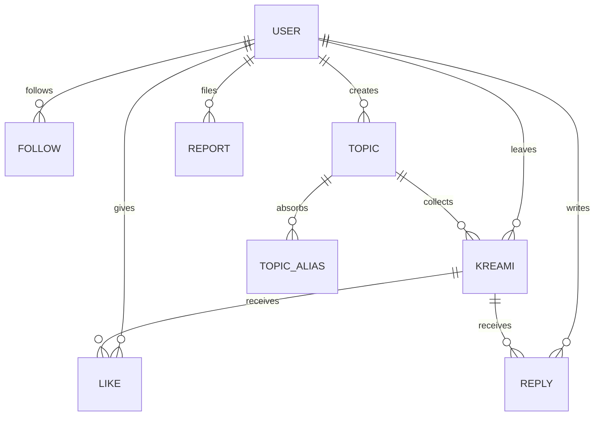
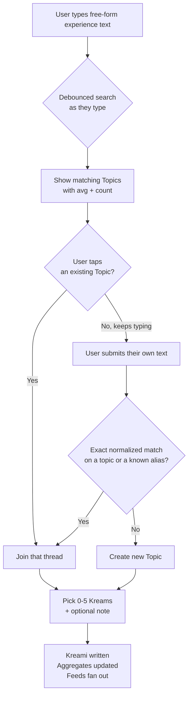

# 02 — Domain Model

The conceptual model, independent of storage. For actual tables see
[04 — Data Model](04-data-model.md).

## Entities

### User
A person. Has a unique `handle` (immutable-ish, lowercase, 3–20 chars), a `display_name`,
an optional bio, and an avatar. Created on first sign-in via Google or magic link.

**Invariant:** a User's handle is unique case-insensitively and cannot collide with a
reserved word (`admin`, `kreami`, `about`, `settings`, `api`, `search`, `feed`, …).

### Topic
A shared experience. This is the spine of the whole app.

- `title` — display form, as first written. Max 80 characters.
- `normalized_title` — the matching key. Lowercased, trimmed, inner whitespace collapsed.
  Nothing else — punctuation and accents are preserved. Unique.
- `slug` — URL-safe identifier, e.g. `eating-a-candy-apple`. Unique, stable.
- `kreami_count`, `rating_sum` — denormalized aggregates, trigger-maintained.
- `merged_into_topic_id` — nullable. When set, this Topic is a tombstone; all reads
  redirect to the target.

**Invariants:**
- A Topic always has ≥ 0 Kreamis. A Topic with 0 Kreamis after a deletion is soft-hidden
  from discovery but not deleted (its slug may be linked externally).
- `normalized_title` is unique across live Topics *and* across the alias table. There is
  exactly one Topic reachable by any given normalized string.
- A merged Topic never receives new Kreamis. Writes to it are transparently redirected.

**Average Kreams** = `rating_sum / kreami_count`, displayed to one decimal (`4.2 Kreams`),
but hidden entirely below a threshold of **3 Kreamis** — an average of one rating is noise,
and showing "5.0" on a single rating creates a misleading signal.

### Kreami
One user's rating of one Topic. The core unit.

- `rating` — integer, **0 through 5 inclusive**.
- `note` — optional text, max 150 characters.
- `created_at`, `updated_at`.

**Invariants:**
- **One Kreami per user per Topic.** Posting again on a Topic you've already rated edits
  your existing Kreami rather than creating a second one. This prevents ballot-stuffing and
  keeps averages honest. Editing is allowed indefinitely; `updated_at` is exposed as
  "edited" in the UI.
- A Kreami cannot exist without a Topic. Deleting a Kreami decrements the Topic's aggregates.
- `rating` has no null state. You cannot leave a note without a number.

### Follow
Directed edge, `follower → followee`. Instant, no approval, no privacy check.
Self-follows are rejected. Unfollow is a hard delete.

### Like
A user liking a Kreami. Unique per (user, kreami). Cheap, reversible, uncounted below the
fold. Self-likes are permitted (nobody cares) but not counted in notifications.

### Reply
A short text response to a Kreami. Max 150 characters, matching notes.
**One level deep only** — no threaded replies-to-replies. This is a deliberate ceiling that
kills a whole class of UI and moderation complexity.

### TopicAlias
A normalized string that routes to a Topic. Created when Topics merge, or when an admin
records a known synonym. Makes merges non-destructive: the old phrasing keeps working forever.

### Report
A user flagging a Kreami, Reply, Topic, or User. Has a reason enum and optional detail.
Feeds an admin queue. See [09 — Security & Moderation](09-security-moderation.md).

### Notification
An in-app activity record: `new_follower`, `kreami_liked`, `kreami_replied`,
`topic_activity` (someone new rated a Topic you've rated). Generated by database triggers.
No push, no email in v1.

## The lifecycle that matters

Everything else is CRUD. This is the flow the entire product rests on:

There is no confirmation step and no machine guess. An exact match — ignoring case only —
joins the thread and cannot produce a duplicate; anything else is a new Topic. The cost of
that simplicity, and what to watch, is in [05 — Topic Matching](05-topic-matching.md).

## Deliberately absent

- **Categories / tags.** Tempting, and wrong for v1. Categorizing "literally anything"
  is an unbounded taxonomy problem, and every category picker adds friction to the ten-second
  post. Discovery is handled by search and recency instead. Revisit only if search proves
  insufficient at scale.
- **Places, products, or any typed entity.** A Topic is a string. That's it.
- **Personal ranked lists.** Designed for (see [11](11-decisions-and-open-questions.md)),
  not built.
