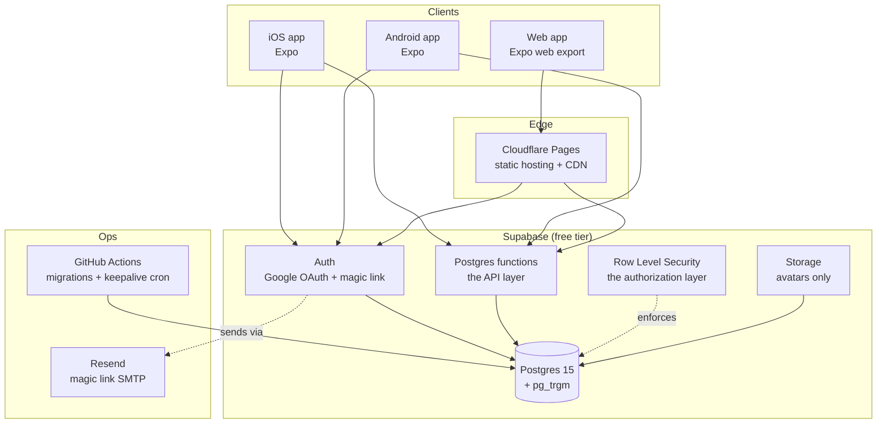

# 03 — Architecture

## Shape

There is no backend server. That's the whole trick.



The client holds a Supabase anon key and talks to Postgres directly over PostgREST.
**Row Level Security is the authorization layer** — not middleware, not a service.
Anything that needs logic beyond a policy (topic matching, feed assembly, counters) is a
`SECURITY DEFINER` Postgres function the client calls by name.

This is the cheapest architecture that is not a toy. It's also the one with the sharpest
edge: **a missing or wrong RLS policy is a full data breach, not a 500 error.** Treat
[09 — Security & Moderation](09-security-moderation.md) as mandatory reading, not an appendix.

## Stack

| Layer | Choice | Why |
|-------|--------|-----|
| App | **Expo SDK 52+ / React Native** with **Expo Router** | One codebase → iOS, Android, and web. File-based routing that maps cleanly to URLs. |
| Language | **TypeScript**, strict | Types generated directly from the Postgres schema via `supabase gen types`. |
| State/data | **TanStack Query** + Supabase JS client | Caching, optimistic updates, infinite scroll — all the feed behavior you'd otherwise hand-roll. |
| Styling | **NativeWind** (Tailwind for RN) | Same class names across native and web. |
| Database | **Supabase Postgres** | Real Postgres. Migrating off Supabase later means moving auth, not data. |
| Auth | **Supabase Auth** — Google OAuth + email magic link | No password storage, no reset flow, no breach surface. |
| Web hosting | **Cloudflare Pages** | Free tier permits commercial use; unlimited bandwidth. See the warning below. |
| Email | **Resend** free tier | Supabase's built-in SMTP is rate-limited to a couple of emails per hour — unusable for magic links. |
| CI/CD | **GitHub Actions** | Migrations, type generation, web deploy, and the keepalive cron. |
| Errors | **Sentry** free tier | 5k errors/month. Add it the day before you have real users, not before. |

### ⚠️ Do not deploy the web app to Vercel's Hobby tier

Vercel's Hobby plan prohibits commercial use. Kreami is non-commercial *today*, but the
moment there's a subscription, an ad, or a sponsorship, the deployment is in violation and
the remedy is a $20/month Pro seat. **Cloudflare Pages** has no such clause, has an
unlimited-bandwidth free tier, and serves a static SPA export perfectly. Netlify is an
acceptable second choice. Start on the one you won't have to leave.

### ⚠️ Supabase free projects pause after ~7 days of inactivity

A paused project is a dead app. The fix is trivial and free: a **GitHub Actions cron**
running every few days that issues a single trivial query. It's in the Phase 0 checklist in
[10 — Roadmap](10-roadmap.md). Don't skip it and then spend an evening debugging "the app is
broken" three weeks after launch.

## Why Expo universal, given you wanted a website

You chose one codebase, which is the right call for a solo builder — but it has a real cost,
and it should be a known cost rather than a surprise:

- **The web export is a client-rendered SPA.** No server rendering. Search engines will
  index it poorly, and a Kreami link pasted into iMessage, Discord, or Twitter renders a
  generic card with no title, no rating, no preview.
- **Bundle size** is heavier than a purpose-built web app. React Native Web carries weight.
- **The mitigation, when it matters:** a tiny Cloudflare Worker that intercepts requests to
  `/t/:slug` and `/u/:handle` from crawler user-agents and returns a minimal HTML document
  with proper OpenGraph tags — title, average Kreams, count — while serving the SPA to
  everyone else. That's roughly 60 lines and runs free. It's **Phase 5**, not Phase 1, but
  it's the difference between a shared link being a link and being an advertisement.

Given that "does anyone screenshot and share this?" is a stated success signal, plan on
building that Worker sooner than feels necessary.

## The $0 budget, honestly accounted

| Service | Free tier ceiling | When it breaks |
|---------|-------------------|----------------|
| Supabase DB | 500 MB | ~2M Kreamis. Not your problem for a long time. |
| Supabase egress | 5 GB/month | The first real limit. Feed queries are chatty — select narrow columns, paginate hard. |
| Supabase MAU | 50,000 | Not your problem. |
| Supabase Storage | 1 GB | Avatars only. Cap at 256×256 and it's effectively unlimited. |
| Cloudflare Pages | Unlimited bandwidth, 500 builds/mo | Not your problem. |
| Resend | 3,000 emails/mo, 100/day | ~100 new-user magic links per day. Fine. |
| GitHub Actions | 2,000 min/mo (free on public repos) | Not your problem. |
| Sentry | 5k errors/mo | Only if something is badly broken, which is when you want to know. |

**Genuinely $0** — as long as the app stays off the app stores. The first unavoidable spend
is **Apple's $99/year** developer account, and **Google Play's $25 one-time** fee. Neither is
needed to ship the web app or to test on your own devices via Expo Go. Budget for them at the
point you actually want App Store distribution, not before.

**The first thing to actually cost money later** is Supabase egress, and the cause will be
feed queries returning too many columns. Design for it now: never `select *` in a feed.

## Environments

Two Supabase projects (the free tier allows two):

- **`kreami-dev`** — local development and preview builds. Seeded with fake data.
- **`kreami-prod`** — the real thing.

Migrations live in the repo as SQL files under `supabase/migrations/`, applied via the
Supabase CLI in CI. **Never click-edit the production schema in the dashboard** — a schema
that exists only in a web UI is a schema you will lose.

## Repository layout

```
kreami/
├── app/                    # Expo Router routes (these are also the web URLs)
│   ├── (tabs)/
│   │   ├── index.tsx       # Home feed
│   │   ├── discover.tsx    # Search + global feed
│   │   ├── post.tsx        # The compose flow
│   │   ├── activity.tsx    # Notifications
│   │   └── profile.tsx     # Your profile
│   ├── t/[slug].tsx        # Topic thread
│   ├── u/[handle].tsx      # A user's profile
│   └── k/[id].tsx          # A single Kreami permalink
├── components/
│   ├── KreamRating.tsx     # THE component. Display + input for 0-5 Kreams.
│   ├── KreamiCard.tsx
│   └── TopicHeader.tsx
├── lib/
│   ├── supabase.ts         # Client + typed helpers
│   ├── queries/            # One file per feature, all TanStack Query hooks
│   └── database.types.ts   # Generated. Never hand-edited.
├── supabase/
│   ├── migrations/         # Ordered SQL. The source of truth for the schema.
│   └── seed.sql            # Dev fixtures
└── .github/workflows/
    ├── deploy-web.yml
    ├── migrate.yml
    └── keepalive.yml       # The cron that keeps the free project awake
```

## Scaling escape hatches

Nothing here needs to be built now. It needs to be *possible* now, and it is:

1. **Feeds get slow (~10k users).** Swap fan-out-on-read for a materialized `feed_entries`
   table populated by a trigger. The client query barely changes. See
   [06 — Feeds & Social Graph](06-feeds-and-social.md).
2. **Egress gets expensive.** Put Cloudflare in front of the read-only RPCs and cache
   Topic pages for 60 seconds. Topic averages are not real-time-critical.
3. **You need real server logic** (recommendations, moderation ML, payments). Add Supabase
   Edge Functions — Deno, same project, no new vendor. Only then consider a real backend.
4. **You outgrow Supabase entirely.** The data is plain Postgres; `pg_dump` moves it to Neon,
   RDS, or a box. The migration cost is concentrated entirely in **auth** — which is precisely
   why the app should never reach into `auth.users` directly, and should always go through the
   `profiles` table it owns. This is the single most important portability rule in the codebase.
