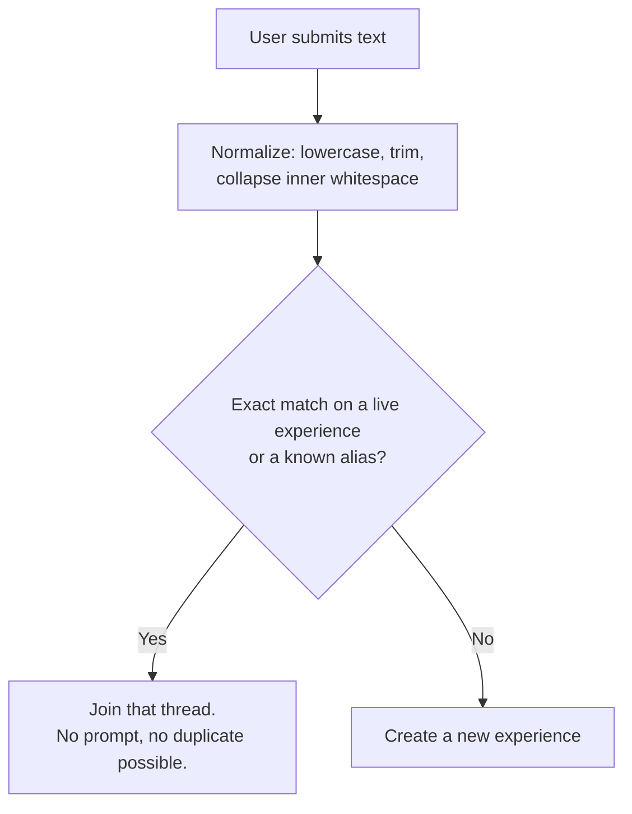

# 05 — Experience Matching

> This is the hardest problem in Kreami and the one most likely to kill it.
> Read this doc before touching the compose flow.

## The problem

You decided users type **whatever they want**. Good — that's true to "rate literally
anything," and any restriction would be friction at the exact moment friction is fatal.

But free-form text plus a shared-thread model is a direct contradiction, and it resolves in
one of two ways:

- **Under-merging:** "Eating a candy apple," "eating candy apples," "Candy apple," and
  "having a candy apple at the fair" become four Experiences with one Kreami each. The app is a
  graveyard. Every thread is a monologue. Nobody comes back.
- **Over-merging:** "Running a marathon" and "Watching a marathon" collapse into one thread.
  Users feel misunderstood and stop trusting the app.

## The rule (decided 2026-08-24)

**Exact match, ignoring case, joins the existing thread and cannot create a duplicate.
Anything else is a new Experience, with no confirmation step.**



That is the whole resolution algorithm. It is deliberately simple, it never blocks a user,
and it never puts a machine's guess in front of a person.

### The tradeoff, stated plainly

This is the **under-merging** side of the fork above, chosen on purpose. Under this rule,
`eating a candy apple` and `eating candy apples` are two separate Experiences forever, because
they are not the same string. So are `Jury duty` and `jury duty.` — one trailing period is
enough to split a thread.

The consequence is concentrated in one number: **median Kreamis per Experience**
(see [10 — Roadmap](10-roadmap.md), Phase 6). If that number sits at 1.0 during the beta,
this rule is the cause, and the remedy is already designed — see *Deferred* at the bottom.
Watch it from the first week.

Two things carry the weight instead, and both matter more now than they would have:

1. **Search-as-you-type**, which is now the *only* thing steering people into existing
   threads before a duplicate exists.
2. **Merging after the fact**, which is now the *only* way a duplicate gets fixed once it
   does.

## Normalization

The matching key. Minimal by design: it implements "same text, ignoring case" and nothing
more.

```sql
create or replace function normalize_experience_title(raw text)
returns text language sql immutable as $$
  select btrim(regexp_replace(lower(raw), '\s+', ' ', 'g'));
$$;
```

That is: lowercase, collapse runs of whitespace to one space, trim the ends. Nothing else.

**What it deliberately does not do**, and the consequence of each:

| Not done | Consequence |
|----------|-------------|
| Strip punctuation | `Jury duty` and `Jury duty.` are different Experiences |
| Fold singular/plural | `candy apple` and `candy apples` are different Experiences |
| Strip leading articles | `The commute` and `Commute` are different Experiences |
| Unaccent | `café` and `cafe` are different Experiences |

Trimming and whitespace-collapsing are included because a trailing space is not something a
user perceives as different text — everything else on that list is a visible character, and
removing it would be the system overruling what someone typed.

**Punctuation is the one worth reconsidering first.** It is the most common accidental split
and the least meaningful difference. If the beta shows duplicate pairs that differ only by a
period or an apostrophe, stripping trailing punctuation is a one-line change to the function
above plus a backfill — much cheaper than reintroducing fuzzy matching.

## Search-as-you-type

Now load-bearing. This is where duplicates are prevented rather than repaired.

```sql
create or replace function search_experiences(q text, lim int default 8)
returns table (
  id uuid, title text, slug text,
  kreami_count int, avg_kreams numeric, score real
)
language sql stable as $$
  with n as (select normalize_experience_title(q) as nq)
  select t.id, t.title, t.slug, t.kreami_count,
         case when t.kreami_count >= 3
              then round(t.rating_sum::numeric / t.kreami_count, 1) end,
         similarity(t.normalized_title, n.nq) as score
  from experiences t, n
  where t.merged_into_experience_id is null
    and t.is_hidden = false
    and t.normalized_title % n.nq          -- uses the GIN trgm index
  order by
    score desc,
    t.kreami_count desc,                   -- popular threads win ties
    t.created_at asc
  limit lim;
$$;
```

Note that **`pg_trgm` is still used here** — fuzzy similarity was removed from *resolution*,
not from *search*. Search should be generous: being shown an option you ignore costs nothing;
not being shown the right thread costs a permanent duplicate. Keep the `%` threshold low
(`0.3`).

**Ranking by `kreami_count` on ties is the gravity well.** Popular experiences get surfaced more,
get joined more, get more popular. Under the exact-match rule this is the main force fighting
fragmentation, so do not weaken it.

**Client behavior:** debounce 250 ms, minimum 2 characters, cancel in-flight requests, cache
by normalized query. Show results directly beneath the input, above the keyboard. Each row
shows the average and the Kreami count — the social proof is what makes tapping more
attractive than typing.

## Resolution at submit

**`resolve_experience()` is internal.** It is granted to nobody and only `post_kreami()` calls it.
If the client could call it directly, merely *previewing* a title would create a experience with
zero Kreamis — exactly the lonely-experience pollution this whole design exists to prevent. A
experience should never exist without at least one rating on it, and making the function
unreachable is what guarantees that rather than hoping the client behaves.

```sql
create or replace function resolve_experience(raw_title text)
returns table (experience_id uuid, matched_title text, is_new boolean)
language plpgsql security definer as $$
declare
  nq text := normalize_experience_title(raw_title);
  hit record;
begin
  if char_length(nq) < 2 then
    raise exception 'Experience title too short';
  end if;

  -- 1. Exact match on a live experience.
  select t.id, t.title into hit
    from experiences t
   where t.normalized_title = nq and t.merged_into_experience_id is null;
  if found then
    return query select hit.id, hit.title, false; return;
  end if;

  -- 2. Exact match on a known alias (a previously merged phrasing).
  select t.id, t.title into hit
    from experience_aliases a join experiences t on t.id = a.experience_id
   where a.normalized_title = nq and t.merged_into_experience_id is null;
  if found then
    return query select hit.id, hit.title, false; return;
  end if;

  -- 3. New experience.
  return query select nt.id, nt.title, true from create_experience(raw_title) nt;
end $$;
```

The uniqueness of `experiences.normalized_title` among live Experiences
(see [04 — Data Model](04-data-model.md)) is what makes "cannot create a duplicate" a
database guarantee rather than an application convention. Even a race between two
simultaneous posts of the same string resolves to one Experience — the loser's insert violates the
unique index and retries into the winner.

### Still log every resolution

```sql
create table experience_resolution_log (
  id serial primary key,
  raw_input text not null,
  normalized text not null,
  matched_experience_id uuid,
  outcome text not null,   -- 'exact' | 'alias' | 'new'
  user_id uuid,
  created_at timestamptz not null default now()
);
```

Under the old design this log existed to tune a threshold. It now serves a more important
purpose: **it is the evidence that decides whether this rule survives the beta.** Every row
with outcome `new` that a human would call a duplicate of an existing Experience is a data point
against the rule. Without the log you will be arguing from anecdote.

## Merging after the fact

Now the primary correction mechanism, not a cleanup afterthought. Expect to run it regularly.

```sql
create or replace function merge_experiences(loser uuid, winner uuid)
returns void language plpgsql security definer as $$
declare loser_norm text;
begin
  if loser = winner then raise exception 'Cannot merge a experience into itself'; end if;

  select normalized_title into loser_norm from experiences where id = loser;

  -- Move Kreamis, dropping any that would violate one-per-user-per-experience.
  -- A user who rated both keeps their rating on the winning experience.
  delete from kreamis k
   where k.experience_id = loser
     and exists (select 1 from kreamis k2
                 where k2.experience_id = winner and k2.user_id = k.user_id);

  update kreamis set experience_id = winner where experience_id = loser;

  -- Tombstone the loser and route its phrasing forever.
  update experiences set merged_into_experience_id = winner where id = loser;
  insert into experience_aliases (normalized_title, experience_id)
    values (loser_norm, winner)
    on conflict (normalized_title) do update set experience_id = winner;

  update experience_aliases set experience_id = winner where experience_id = loser;

  perform recompute_experience_aggregates(winner);
  perform recompute_experience_aggregates(loser);
end $$;
```

The alias write is what makes merging compound: once `eating candy apples` has been merged
into `Eating a candy apple`, every future person who types the plural lands on the right
thread **by exact match on the alias**. The system gets better at deduplication over time
without any fuzzy logic at all — it just has to be taught, once, per phrasing.

**A merge is not fully reversible** (the deleted duplicate Kreamis are gone). Two guards:
admin-only in v1, and every merge logged to a `experience_merges` audit table.

### Finding merge candidates

Nightly GitHub Action; posts the top 20 somewhere you'll read them.

```sql
select a.id, a.title, a.kreami_count,
       b.id, b.title, b.kreami_count,
       similarity(a.normalized_title, b.normalized_title) as s
  from experiences a join experiences b
    on a.id < b.id
   and a.normalized_title % b.normalized_title
 where a.merged_into_experience_id is null
   and b.merged_into_experience_id is null
   and similarity(a.normalized_title, b.normalized_title) between 0.5 and 0.99
 order by (a.kreami_count + b.kreami_count) desc, s desc
 limit 20;
```

Ordering by combined `kreami_count` is the point: merging two dead experiences helps nobody;
merging two experiences with 20 Kreamis each creates a thread with 40.

**Under the exact-match rule, treat this report as a weekly chore rather than a background
job you check occasionally.** It is the only repair mechanism the system has.

## Redirects for merged experiences

Old links must keep working — people share them.

```sql
create or replace function get_experience_by_slug(s text)
returns experiences language sql stable as $$
  select coalesce(w.*, t.*) from experiences t
    left join experiences w on w.id = t.merged_into_experience_id
   where t.slug = s;
$$;
```

The client sees the winning Experience and quietly rewrites the URL. No 404, no explanation needed.

## Deferred

Both of these are designed, and neither is built. They exist here so the remedy is on the
shelf if the beta data calls for it.

### Fuzzy confirmation ("Did you mean?")

The removed layer: when a submitted string has no exact match but scores above a similarity
threshold against an existing Experience, show a confirmation with the existing thread's average
and count, and a permanently visible **"Mine's different — post separately"** escape hatch.
The screen is already drawn (see the design canvas, marked DEFERRED).

**Reinstate when:** median Kreamis per Experience stays near 1.0 in the beta, and the resolution
log shows a steady stream of `new` outcomes that are near-misses of existing Experiences.
Reintroducing it means adding one similarity query to `resolve_experience`, a confidence field on
the return, and a `force_new` parameter on `post_kreami` for the escape hatch.

**Cheaper thing to try first:** stripping punctuation in `normalize_experience_title`. It fixes the
most common accidental split with no new UI and no user-facing guesswork.

### Embedding-based clustering

Trigram similarity is **lexical**. It cannot tell you that "jury duty" and "serving on a jury"
are the same experience. Only semantic embeddings can.

Still the wrong thing to build early: it costs money per post, needs `pgvector` and an index
strategy, and needs a threshold you have no data to tune. **Revisit when** the nightly
duplicate report fills with semantic pairs that trigram scored below 0.5.
