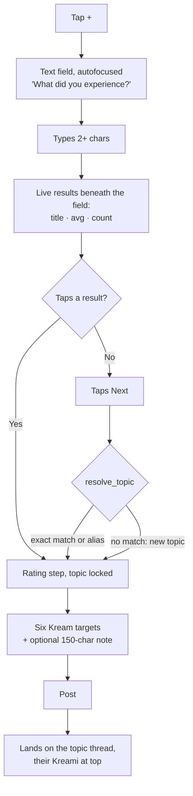

# 08 — UX Flows

## Navigation

Five tabs, Beli-style, with the compose action in the center.

```
┌─────────────────────────────────────────┐
│  Home   Discover   [ + ]   Activity  Me │
└─────────────────────────────────────────┘
```

Expo Router maps these to real URLs, so the web export gets shareable links for free:

| Route | URL | Screen |
|-------|-----|--------|
| `(tabs)/index` | `/` | Home feed |
| `(tabs)/discover` | `/discover` | Search + active topics |
| `(tabs)/post` | `/post` | Compose (modal on native) |
| `(tabs)/activity` | `/activity` | Notifications |
| `(tabs)/profile` | `/me` | Your profile |
| `t/[slug]` | `/t/eating-a-candy-apple` | Topic thread |
| `u/[handle]` | `/u/manish` | Someone's profile |
| `k/[id]` | `/k/:id` | Single Kreami permalink |

`/t/:slug` and `/k/:id` are the **shareable** URLs. They must render for logged-out visitors
— that's the entire top of the funnel, and it's why anonymous read access exists in the RLS
policies.

## The Kream rating control

The signature component. Everything else is a list.

**Display:** five filled/unfilled Kream glyphs plus the numeral.

```
  ●●●●○   4/5 Kreams
```

**A rating of 0 must be visibly distinct from "unrated."** Five empty glyphs alone read as
"nobody has rated this," which is exactly wrong when someone has deliberately delivered the
harshest verdict in the app.

**The numeral carries the distinction.** The score is always rendered beside the glyphs,
never on its own, and at 0 it is set in the accent color:

```
  ○○○○○                     ← wrong: glyphs alone are ambiguous
  ○○○○○  0/5 Kreams         ← right: the numeral is present and accented
```

An unrated Topic never shows a glyph row at all — it shows "Not enough Kreamis yet" — so the
two states never actually collide in the UI.

**Input:** six tap targets, 0 through 5, each at least 44×44 pt. On mobile, support drag
across the row. **Do not use a slider** — sliders imply a continuous scale, and the whole
premise is six discrete values.

**The glyph itself is the brand.** Whatever a "Kream" looks like — a dollop, a swirl, a
blob — it needs to be legible at 16 pt, work in a single flat color, and be instantly
recognizable in a screenshot. Commission or design this properly; it's the one visual asset
that carries the product.

## The compose flow

The ten-second path. Guard it jealously — every element below is either load-bearing or cut.



**Two steps, always.** Text, then rating. The note lives on the rating step as an optional
field, not a separate screen. There is no confirmation step between them — an exact match
joins silently, anything else creates a Topic silently.

**The results list is the whole deduplication strategy.** Under the exact-match rule nothing
downstream catches a near-duplicate, so this list has to be fast, generous, and impossible to
miss. Give it real estate and show each row's average and count — the social proof is what
makes tapping more attractive than typing.

**Landing on the thread after posting** rather than bouncing to the feed is deliberate: it
shows the user what they joined, and if others are there, it delivers the core payoff
immediately.

### If they've already rated this Topic

Don't error and don't silently overwrite. The rating step pre-fills with their existing
Kreami and the button reads **"Update your Kreami"** — with the original date shown. Honest,
and it makes the one-per-topic rule feel like a feature rather than a rejection.

## Home feed card

```
┌────────────────────────────────────────────┐
│ ◉ manish · 2h                              │
│                                            │
│ Eating a candy apple                       │
│ ●●●●○  4/5 Kreams                          │
│                                            │
│ "Structurally unsound. Emotionally         │
│  perfect."                                 │
│                                            │
│ ♡ 12   ↩ 3        4.2 avg · 38 Kreamis  →  │
└────────────────────────────────────────────┘
```

The Topic's average and count sit in the corner as a **tappable affordance into the thread**.
That's the mechanism that converts a passive feed reader into a thread participant, and it's
worth the visual clutter.

## Topic thread

```
┌────────────────────────────────────────────┐
│  Eating a candy apple                      │
│  ●●●●○  4.2 Kreams · 38 Kreamis            │
│                                            │
│  5 ████████████  14                        │
│  4 ██████████████████  19                  │
│  3 ██  2                                   │
│  2 █  1                                    │
│  1                                         │
│  0 ██  2                                   │
│                                            │
│  [ Leave a Kreami ]                        │
├────────────────────────────────────────────┤
│  Recent  ·  Top  ·  Highest  ·  Lowest     │
├────────────────────────────────────────────┤
│  ◉ manish  ●●●●○ 4/5                       │
│  "Structurally unsound. Emotionally        │
│   perfect."                        ♡ 12    │
├────────────────────────────────────────────┤
│  ◉ dana  ⊘ 0/5                             │
│  "Broke a molar. Would not recommend."     │
│                                    ♡ 47    │
└────────────────────────────────────────────┘
```

The histogram is the most valuable pixel real estate in the app. It shows disagreement, and
disagreement is the interesting part. Show it above the fold, always.

**"Leave a Kreami" is the primary action on every thread**, including for logged-out visitors
— tapping it prompts sign-in and then returns them to this exact thread with their intent
preserved.

## Profile

```
┌────────────────────────────────────────────┐
│  ◉  Manish                                 │
│     @manish                                │
│     Rating the mundane since 2026          │
│                                            │
│  142 Kreamis · 89 followers · 76 following │
│  Average Kream given: 3.4                  │
│                                            │
│         [ Follow ]                         │
├────────────────────────────────────────────┤
│  Recent  ·  Highest  ·  Lowest             │
├────────────────────────────────────────────┤
│  … their Kreamis …                         │
└────────────────────────────────────────────┘
```

**"Average Kream given"** is the personality stat. A 4.6 is a person who loves everything;
a 1.8 is a person whose 5/5 means something. It gives people a number to have opinions about,
which is free engagement.

**Highest / Lowest sorts on a profile** are the best browsing experience in the app. Someone's
0/5 list is the fastest way to understand them.

## Onboarding

Four screens, no more:

1. **What this is** — one sentence and an example Kreami. Not a carousel.
2. **Sign in** — Google button, or email for a magic link. Nothing else.
3. **Pick a handle** — live availability check, display name pre-filled from the OAuth profile.
4. **Follow a few people** — the curated `suggested_profiles` list, plus a
   **"Leave your first Kreami"** prompt that drops straight into compose.

Getting a user to post once during onboarding is worth more than any other onboarding
metric. Make that the last screen's primary action.

## Empty and edge states

| State | What to show |
|-------|--------------|
| Home feed, no follows | Discover feed inline: *"Follow people to build your feed. Meanwhile:"* |
| Home feed, few follows | Backfill with global, visually distinct, capped at half the page |
| Topic with 1–2 Kreamis | *"Not enough Kreamis for an average yet"* — never a misleading 5.0 |
| Search, no results | *"Nobody's rated that yet. Be first."* → straight into compose |
| Activity, empty | *"Nothing yet. Kreamis you leave will show up here when people react."* |
| Offline | Cached feed with a banner. TanStack Query persistence handles this. |

The search empty state is a **conversion opportunity, not an apology**. "Be first" is the
right emotional frame for a rating app.

## Accessibility

- The Kream control needs real `accessibilityLabel`s: *"Rate 4 out of 5 Kreams."*
- **Never encode rating in color alone.** Filled vs unfilled must differ in shape.
- Support Dynamic Type; the 150-char note must reflow, never truncate.
- Contrast ≥ 4.5:1 for all text, including the muted metadata line. The palette was
  corrected to meet this — `muted` `#786F66` is 4.61:1 on paper, and there is deliberately
  no lighter text token. See [11 — Decisions](11-decisions-and-open-questions.md), D14.
- The **unfilled** Kream glyph is `#958D82` (3.06:1), not decoration: it is half the rating,
  so it carries the 3:1 non-text minimum.

## Visual direction

Warm rather than clinical — this is a playful app about candy apples and jury duty, not an
analytics dashboard. One strong accent color for the Kream glyph, generous whitespace,
a typeface with personality in the numerals (the numerals are the product).

**Design for the screenshot.** The single most valuable thing a user can do is screenshot a
Kreami and send it to a friend — it's the only viral loop v1 has. Every card should look
good cropped, with the title, the glyphs, the number, and the handle all legible without
context.
